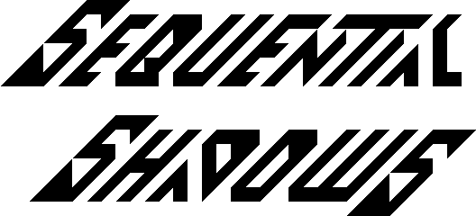

   

Sequential Shadows
==================
Curly / Medieval presents

my contribution to the [Tiny Tapeout](https://tinytapeout.com/) 8 demo competition.
Code, graphics, and music by Curly (Toivo Henningsson) of Medieval.

The demo can be seen at https://youtu.be/pkiTu3iLA_U (captured from a Verilator simulation).

[Read the documentation](docs/info.md)
